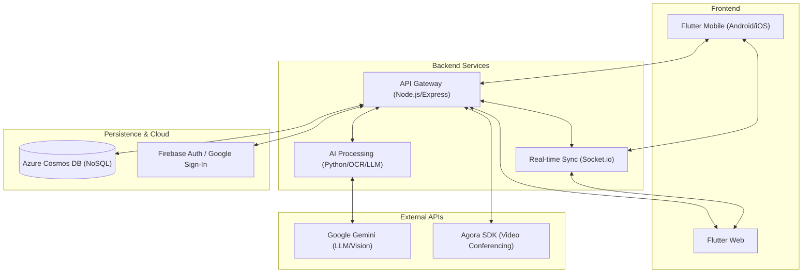
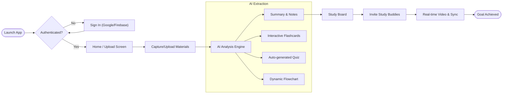

# Study Buddy 🎓
### *AI-Powered Collaborative Learning Platform*

Study Buddy transforms your study materials into interactive learning experiences. Capture notes, generate flashcards, visualize concepts with flowcharts, and collaborate in real-time—all in one place.

---

## 🏗️ 1. System Architecture
Study Buddy is built with a modern, scalable stack designed for real-time collaboration and AI processing.



---

## 🗺️ 2. User Flow
From raw notes to collaborative mastery.



---

## 🛠️ 3. Under the Hood (Tech Stack)

### **Frontend**
- **Flutter**: Cross-platform mobile and web application.
- **State Management**: Provider/ChangeNotifier for clean reactive UI.
- **Real-time**: Agora (Video) & Socket.io (Data Sync).

### **Backend**
- **Node.js/Express**: Scalable API Gateway.
- **Python (LLM Integration)**: Specialized OCR and RAG handlers for study materials.
- **Azure Cosmos DB**: High-performance NoSQL database for flexible study document structures.
- **Firebase Auth**: Secure, easy-to-use identity management.

---

## 🎨 4. Brand & Identity
Study Buddy features a **Premium Dark UI** with vibrant cyan accents (`#00E5FF`), designed to reduce eye strain during long study sessions and provide a professional, state-of-the-art feel.

---

## 🚀 5. Getting Started

### Prerequisites
- Flutter SDK (`^3.11.0`)
- Node.js (`v18+`)
- Firebase Account

### Installation
1.  **Client:**
    ```bash
    cd studybuddy_client
    flutter pub get
    flutter run
    ```
2.  **Server:**
    ```bash
    cd studybuddy_server
    npm install
    npm start
    ```

---

*Built for the next generation of students. Empower your learning today.*
