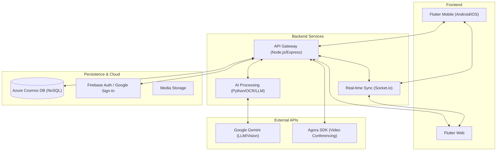
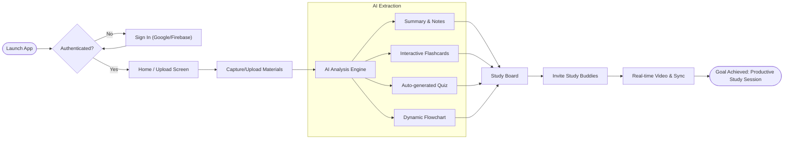

# Study Buddy - Project Submission Artifacts

> [!NOTE]
> This document provides a high-level blueprint of the Study Buddy platform, detailing its architecture, user journey, and data structures.

---

## 🏗️ 1. System Architecture Diagram
A high-level view of how Study Buddy's components interact.

---

## 🗺️ 2. User Flow Map
The journey from material upload to collaborative study.

---

## 🗄️ 3. Database Schema (NoSQL)
Built on **Azure Cosmos DB** for high scalability and flexible schema handling.

| Collection | Key Objects | Purpose |
| :--- | :--- | :--- |
| `Participant` | `uid`, `email`, `displayName`, `history` | User profiles and study history pointers. |
| `Documents` | `id`, `notes`, `flashcards`, `flowchart`, `quiz` | The processed AI output for a specific raw input. |
| `Groups` | `groupId`, `inviteCode`, `participants`, `activeDoc` | Collaboration session metadata and access logs. |

---

## 🎨 4. Design & Visuals
### Brand Kit
- **Primary Color:** `#00E5FF` (Vibrant Cyan) - Represents clarity and modern tech.
- **Secondary Color:** `#1A1A1A` (Deep Slate) - Provides a premium dark-mode aesthetic.
- **Typography:** *Outfit / Inter* - Clean, sans-serif fonts for maximum readability.

### Mockups

*Figure 1: Clean, intuitive upload interface emphasizing simplicity.*

*Figure 2: Real-time collaborative board featuring synchronized notes and video conferencing.*

---

## 🧠 5. The "Product Brain" (Documentation)

### API Structure
- **Auth:** Standard Bearer token authentication via Firebase.
- **Upload:** `POST /api/upload` - Handles multi-part file uploads (PDF/Images).
- **History:** `GET /api/history` - Retrieves user past sessions with efficient pagination.
- **Real-time:** Custom Socket.io events (`draw`, `sync_tab`, `cursor_move`) for zero-latency collaboration.

### Trade-offs & Rationale
- **Why Flutter?** We chose Flutter to maintain a single codebase for Web and Mobile without sacrificing performance. This allowed us to launch on Android and Vercel (Web) concurrently.
- **Why Cosmos DB?** NoSQL was essential for the "Document" structure. Since different AI outputs (Flashcards vs. Flowcharts) have wildly different JSON structures, Cosmos DB's schema-less nature saved hundreds of hours in migration logic.
- **Hybrid AI Model:** We use a mix of OCR for raw text and LLM Vision for spatial understanding (Flowcharts). This dual-layer approach provides higher accuracy than standard text-only models.
